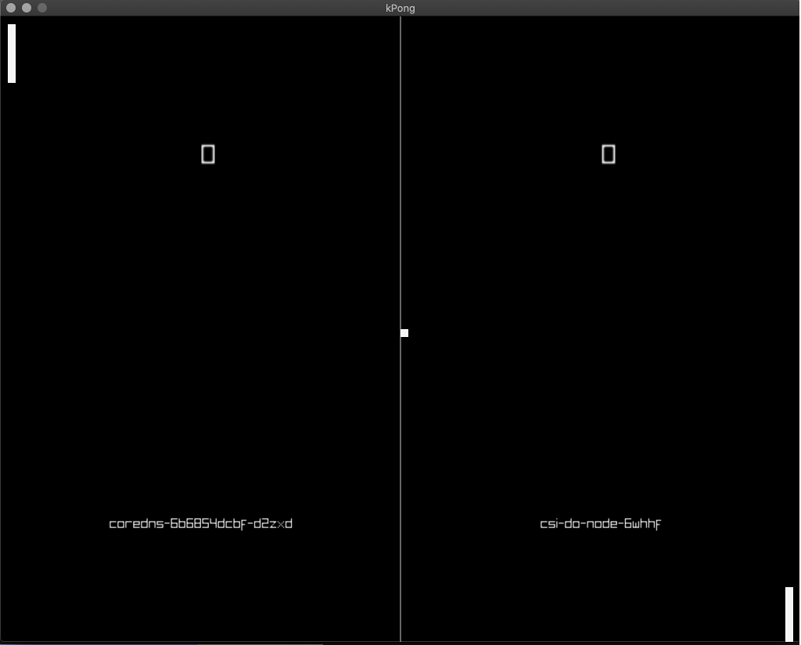

# kPong


kPong is a chaos game for kubernetes. It is pong, with high stakes. If you lose the round, you lose your pod.

DO NOT PLAY THIS IN PRODUCTION.

## Downloading

See the [releases page](https://github.com/ryanhartje/kpong/releases) for stable versions.

The current release enables 2 players to play with 1 keyboard using these bindings:
|Key|Description|
|-|-|
|escape|Exit the game|
|space|Serve the ball (start round)|
|w|Move player 1 (left paddle) up|
|s|Move player 1 (right paddle) down|
|↑|Move player 2 (left paddle) up|
|↓|Move player 2 (right paddle) down|

At the command line, the following flags are available for configuration:

|Flag|Default|Description|
|-|-|
|--host|127.0.0.1:27017|Specify location for kubeconfig|
|--hostIP||Specify location for kubeconfig|
|--kubeconfig|Specify location for kubeconfig|
|--namespace|Specify the namespace you want to select from, or leave empty for all namespaces|

## Development

### MacOS

You will need xcode before you can use CGO, then get the repo and build:
```
xcode-select --install
go get github.com/ryanhartje/kpong
cd ~/go/src/github.com/ryanhartje/kpong
go build cmd/kpong/kpong.go
```

### Linux

After installing golang, run:
```
go get github.com/ryanhartje/kpong
cd ~/go/src/github.com/ryanhartje/kpong
go build cmd/kpong/kpong.go
```

### Windows

Windows seems to be a tricky environment, at least for me. I am able to build and run this project within mingw and golang's windows distribution. You can find these here:
[mingw](https://sourceforge.net/projects/mingw-w64/files/Toolchains%20targetting%20Win32/Personal%20Builds/mingw-builds/installer/mingw-w64-install.exe/download)
[golang]()

For Mingw specifically, please see [this article](https://medium.com/@martin.kunc/golang-compile-go-gl-example-on-windows-in-mingw-64-bfb6eb66a143) for better instructions for installation config.

Once setup, you should be able to open a MinGW shell and run:
```
go get github.com/ryanhartje/kpong
cd $HOME/go/src/github.com/ryanhartje/
go build cmd/kpong/kpong.go
```